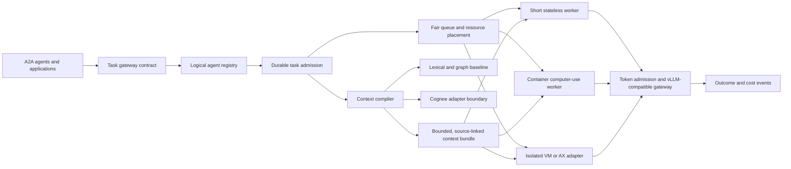

# SwarmContext Plane

**Inspectable context compilation and admission for large logical-agent fleets.** SwarmContext Plane is a standalone reference kernel for registering virtual agents, admitting idempotent tasks, selecting bounded context, choosing a runtime class, and reserving inference tokens. It is designed to interoperate with A2A agents, Cognee, browser agents, vLLM, Google/AX, and other runtimes without claiming those live integrations are already deployed.

**Current claim:** the repository contains a single-node SQLite registry, in-memory weighted deficit-round-robin scheduler, lexical/graph context baseline, source-deletion tombstones, bounded vLLM-compatible loopback client, A2A-inspired task sidecar, computer-use event normalizer, Terraform configuration module, and explicit infrastructure examples. The 150,000-agent benchmark registers *logical descriptors*; it does **not** run 150,000 models or browsers. All data in the demo and benchmark is synthetic.

## Run it

From the repository root with Python 3.10+:

```bash
PYTHONPATH=src python3 -m swarmcontext demo
PYTHONPATH=src python3 -m unittest discover -s tests -v
PYTHONPATH=src python3 -m swarmcontext bench-fleet \
  --agents 150000 --active-tasks 10000 --tenants 100 \
  --output outputs/fleet-local.json
```

The benchmark reports registration, enqueue, and drain times for the local process and SQLite file. It labels A2A throughput, browser concurrency, Cognee latency, vLLM throughput, distributed recovery, and GPU economics as **not measured**. A working `pip install -e .` also exposes `swarmcontext`.

The [first local 150k-logical-agent result](benchmarks/results/local-150k-2026-09-25.json) is a single macOS/arm64 run: 150,000 descriptors registered in 2.6023 seconds and 10,000 synthetic queued tasks drained in 0.0165 seconds. Those timings exclude network, model inference, browser execution and multi-node coordination; rerun them on your own hardware before using them in capacity planning.

## Architecture



An agent record is not a process. Agents become active only when a task obtains queue capacity, context, and an execution placement. Terraform provisions durable infrastructure; KEDA and HPA can later activate CPU workers from queue metrics; GPU inference has a separate capacity loop. See [architecture and scaling](docs/architecture.md).

## Implemented contracts

| Component | Current behavior | Limit |
| --- | --- | --- |
| Registry | SQLite WAL, tenant membership, idempotent task submission, lease attempts and fenced completion | Single-node reference; no distributed consensus or network API |
| Scheduler | Per-tenant heaps, weighted deficit round robin, bounded estimated token cost | In memory; priority aging, distributed persistence and reservations remain future work |
| Context | Versioned personal policy for scope/trust/term preference/token budget, lexical match, one-hop graph expansion, content hashes, tombstones and expiry | No vector search, semantic entailment, durable graph or Cognee-native validation |
| Runtime placement | Stateless → serverless; browser/write/long → container; code/high isolation → microVM | Classification only; no executor launches |
| Inference | Hard in-flight token reservations, tenant-scoped prefix-cache salt, opt-in loopback vLLM-compatible chat request | No GPU scheduler, vLLM benchmark or live model call in CI |
| Interoperability | A2A-inspired task sidecar, normalized computer-use receipts and saved Cognee CHUNKS normalizer | Not full A2A conformance or native provider execution |

The A2A [specification](https://github.com/a2aproject/A2A/blob/main/docs/specification.md) defines actual Task, Message, Artifact and operation semantics. This repository's sidecar is deliberately labeled **A2A-inspired**, so it cannot be mistaken for a conformance implementation. The vLLM `cache_salt` request parameter follows [vLLM prefix-cache isolation](https://docs.vllm.ai/en/latest/design/prefix_caching/); the opt-in local HTTP path requires a private `SWARMCONTEXT_CACHE_SALT_SECRET` to derive tenant-specific salts. An authenticated gateway must bind tenant identity; a caller-supplied tenant string is not an authorization mechanism. Application-level request grouping does not replace vLLM's own continuous batching.

## Scale and cost accounting

The headline fleet test has four separate axes: logical agents, concurrent active tasks, computer-use sessions, and input/output tokens per second. If each of 150,000 agents emits one event per minute, the event plane must sustain **2,500 events/s** before retries. If each event required 1,000 input tokens, demand would be **2.5 million input tokens/s**—a hypothetical workload calculation, not achieved throughput.

Track cost per accepted task as:

`(model inference + GPU idle capacity + CPU workers + browser/VM minutes + storage + queue/egress + human review) / independently accepted tasks`

The benchmark must publish both the numerator and acceptance definition, plus p95/p99 latency, error rate, cross-tenant isolation, task recovery, context recall, and quality regression. Registration speed alone cannot establish production readiness. See [benchmark protocol](docs/benchmark-protocol.md).

## Relationship to A2Z projects

- [AI Agent Runtime Gateway](https://github.com/AAH20/ai-agent-runtime-gateway) is a candidate authority and execution-planning boundary; this repo owns context compilation, fair admission, and logical-fleet measurement.
- [swarm-substrate](https://github.com/AAH20/swarm-substrate) offers trust/control primitives; integrate only after independent compatibility tests.
- [swarm-eval-harness](https://github.com/AAH20/swarm-eval-harness) is a candidate adversarial evaluation source.
- [context-graph-compact](https://github.com/AAH20/context-graph-compact) and `kv-compress-x` are candidate optimizations. Their performance and accuracy claims must be retested against this repo's fixed baselines before default use.
- Growth Decision Engine, Outcome Fabric, Entity Continuity, GRC Claw, and other A2Z projects could be task producers or consumers through versioned adapters, not implicit dependencies.

## Operational boundary

No customer credentials, browser profiles, or personal data belong in this repository. The local vLLM client permits only an explicitly approved loopback call. The Kubernetes manifests under `infra/kubernetes/` have **placeholder** images and endpoints and must not be applied unchanged. The Terraform module creates a namespace and admission ConfigMap only; it neither deploys workers nor provisions nodes, GPUs, queues or microVMs. A real deployment needs identity, durable distributed storage, isolated execution, access policy, observability, tested recovery, and native provider contract tests.

Licensed under Apache-2.0.
