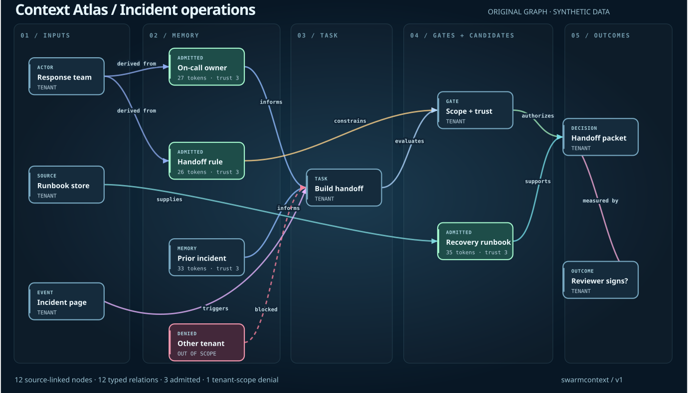
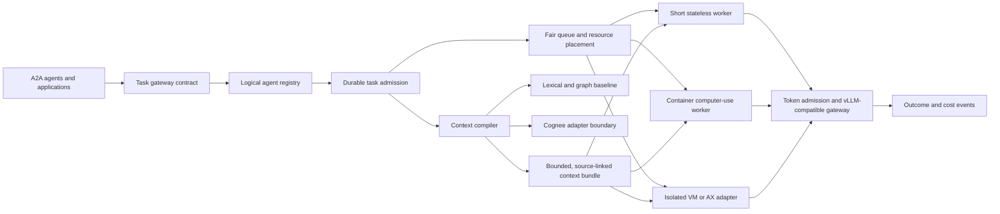

# Swarm-Context-Commander

**AI agent memory, context engineering, and multi-agent orchestration you can inspect and benchmark.** Swarm-Context-Commander is a standalone reference kernel for registering virtual agents, admitting idempotent tasks, selecting bounded context, choosing a runtime class, and reserving inference tokens. It is designed to interoperate with A2A agents, Cognee, browser agents, vLLM, Google/AX, and other runtimes without claiming those live integrations are already deployed.

If you are looking for an **MCP server for agent context**, a reproducible **GraphRAG baseline**, or a way to reason about **150K logical agents**, start here. The new stdio MCP server exposes bounded inline-context compilation and runtime placement; it does not expose a remote multi-tenant service.

<!-- mcp-name: io.github.AAH20/swarm-context-commander -->

**Current claim:** the repository contains a single-node SQLite registry, in-memory weighted deficit-round-robin scheduler, lexical/graph context baseline, tenant-scoped source-deletion tombstones, bounded loopback Cognee and vLLM clients, A2A-inspired task sidecar, executable synthetic computer-use worker, local MCP server, Terraform configuration module, and explicit infrastructure examples. The 150,000-agent benchmark registers *logical descriptors*; it does **not** run 150,000 models or browsers. All data in the demo and benchmark is synthetic.

## Personalization Atlas

The [live interactive Context Atlas](https://aah20.github.io/Swarm-Context-Commander/) is an original, dependency-free evidence graph for an everyday consumer, an SMB merchant and an enterprise incident team. Explore typed directed relations, source provenance, scope and trust, token admission, a policy gate, and a measured outcome. Search and filter the graph, inspect nodes or edges, trace paths, drag nodes, pan/zoom, and export the current SVG. Its [source](listings/huggingface-space/index.html) is in this repository. Run the matching inspectable Python baseline with `swarm-context-commander personalization-demo`. The page is a simulation; the Python code implements tenant/agent scope checks and an in-memory UCB1 selector over approved policy variants. Neither trains a model or connects to customer systems.



*Original enterprise scenario preview, generated from the same synthetic graph fixture as the interactive Atlas. Regenerate it with `node scripts/render-atlas-preview.cjs`.*

The [personalization and learning architecture](docs/personalization-and-learning.md) specifies the next gates: supervised ranking and outcome prediction, unsupervised cohort/drift analysis, graph features, causal experiments, constrained bandits and sandboxed RL. It separates implemented baselines from proposed systems and defines recall, accepted work, cost, latency, drift, leakage and subgroup evaluations. The [project reference ledger](docs/project-references.md) names the upstream systems that informed boundaries and the actual integration status of each.

## 100 candidate workloads

The [numbered workload catalog](docs/100-workloads.md) spans ten domains: licensed and public data, continuous BI, synthetic training environments, product audiences and pricing, due diligence, computer use, agent infrastructure, physical AI, cyber defense, and dual-use assurance. Each of its 100 proposals has candidate inputs, evaluation KPIs, a fully loaded unit-cost denominator, a maturity phase and a hard release gate. The [machine-readable catalog](catalog/workloads.json) is generated from [one source file](catalog/workloads.psv) and validated in CI. The catalog is a map of possible applications, **not** a claim that 100 integrations or workloads are deployed.

## Evolution and evaluation standard

The [versioned evaluation standard](docs/evolution-evaluation-standard.md) defines graph construction and GraphRAG tests, deterministic and probabilistic model selection, deep-agent scaling axes, human command capacity, and phase-specific release gates. Its [machine-readable metric matrix](benchmarks/evolution-matrix.json) separates the one implemented synthetic graph fixture from proposed benchmark tracks. The standard compares upstream GraphRAG, memory, computer-use, inference and embodied suites on their own protocols, then adds new system-level challenges without claiming leaderboard superiority. High-assurance and physical-AI profiles are conditional research designs, not deployed or accredited capabilities.

## Installable interfaces

| Interface | Get started | Scope |
| --- | --- | --- |
| Python CLI | `pip install .` then `swarm-context-commander demo` | Local synthetic end-to-end example |
| MCP server | `pip install '.[mcp]'` then `swarm-context-mcp` | Two stdio tools for inline context and placement; [configuration](docs/mcp-server.md) |
| Agent skill | `npx skills add AAH20/Swarm-Context-Commander --skill agent-context-engineering` | [skills.sh listing](https://skills.sh/aah20/swarm-context-commander/agent-context-engineering) and [source](skills/agent-context-engineering/SKILL.md) |

The MCP server and skill are installable from this repository. Public package-registry and hosted listings have separate publication status; the presence of a `server.json` manifest alone does not make an MCP Registry entry.

## Run it

From the repository root with Python 3.10+:

```bash
python3 -m pip install -e .
swarm-context-commander demo
swarm-context-commander personalization-demo
swarm-context-commander eval-graph
swarm-context-commander bench-fleet --agents 150000 --active-tasks 10000 --tenants 100

# Or run directly from the checkout without installing:
PYTHONPATH=src python3 -m swarmcontext demo
PYTHONPATH=src python3 -m unittest discover -s tests -v
PYTHONPATH=src python3 -m swarmcontext bench-fleet \
  --agents 150000 --active-tasks 10000 --tenants 100 \
  --output outputs/fleet-local.json
PYTHONPATH=src python3 -m swarmcontext context-cognee \
  --query 'refund reconciliation' --tenant synthetic-tenant --agent analyst-1 \
  --response-file fixtures/cognee-chunks.synthetic.json \
  --output outputs/context-synthetic.json
```

The benchmark reports registration, enqueue, and drain times for the local process and SQLite file. It labels A2A throughput, browser concurrency, Cognee latency, vLLM throughput, distributed recovery, and GPU economics as **not measured**. A working `pip install -e .` exposes `swarm-context-commander`; the existing `swarmcontext` command remains an alias.

The [first local 150k-logical-agent result](benchmarks/results/local-150k-2026-09-25.json) is a single macOS/arm64 run: 150,000 descriptors registered in 2.6023 seconds and 10,000 synthetic queued tasks drained in 0.0165 seconds. Those timings exclude network, model inference, browser execution and multi-node coordination; rerun them on your own hardware before using them in capacity planning.

## Architecture



An agent record is not a process. Agents become active only when a task obtains queue capacity, context, and an execution placement. Terraform provisions durable infrastructure; KEDA and HPA can later activate CPU workers from queue metrics; GPU inference has a separate capacity loop. See [architecture and scaling](docs/architecture.md).

## Implemented contracts

| Component | Current behavior | Limit |
| --- | --- | --- |
| Registry | SQLite WAL, tenant membership, idempotent task submission, lease attempts and fenced completion | Single-node reference; no distributed consensus or network API |
| Scheduler | Per-tenant heaps, weighted deficit round robin, bounded estimated token cost | In memory; priority aging, distributed persistence and reservations remain future work |
| Context | Versioned personal policy for scope/trust/term preference/token budget, lexical match, one-hop graph expansion, content hashes, tenant-scoped tombstones and expiry | No vector search, semantic entailment, durable graph or live Cognee validation |
| Runtime placement | Stateless → serverless; browser/write/long → container; code/high isolation → microVM | Classification only; no executor launches |
| Inference | Hard in-flight token reservations, tenant-scoped prefix-cache salt, opt-in loopback vLLM-compatible chat request | No GPU scheduler, vLLM benchmark or live model call in CI |
| Interoperability | A2A-inspired task sidecar, synthetic worker, normalized computer-use receipts and opt-in local Cognee CHUNKS HTTP adapter | HTTP contract is mocked in CI; not full A2A conformance or native computer-use execution |

The A2A [specification](https://github.com/a2aproject/A2A/blob/main/docs/specification.md) defines actual Task, Message, Artifact and operation semantics. This repository's sidecar is deliberately labeled **A2A-inspired**, so it cannot be mistaken for a conformance implementation. The vLLM `cache_salt` request parameter follows [vLLM prefix-cache isolation](https://docs.vllm.ai/en/latest/design/prefix_caching/); the opt-in local HTTP path requires a private `SWARM_CONTEXT_COMMANDER_CACHE_SALT_SECRET` to derive tenant-specific salts. The former `SWARMCONTEXT_CACHE_SALT_SECRET` name remains a compatibility fallback. An authenticated gateway must bind tenant identity; a caller-supplied tenant string is not an authorization mechanism. Application-level request grouping does not replace vLLM's own continuous batching.

## Scale and cost accounting

The headline fleet test has four separate axes: logical agents, concurrent active tasks, computer-use sessions, and input/output tokens per second. If each of 150,000 agents emits one event per minute, the event plane must sustain **2,500 events/s** before retries. If each event required 1,000 input tokens, demand would be **2.5 million input tokens/s**—a hypothetical workload calculation, not achieved throughput.

Track cost per accepted task as:

`(model inference + GPU idle capacity + CPU workers + browser/VM minutes + storage + queue/egress + human review) / independently accepted tasks`

The benchmark must publish both the numerator and acceptance definition, plus p95/p99 latency, error rate, cross-tenant isolation, task recovery, context recall, and quality regression. Registration speed alone cannot establish production readiness. See [benchmark protocol](docs/benchmark-protocol.md).

## Common questions

**How do I give an AI agent memory without overflowing its context window?** Send candidate records to `compile_agent_context` with a fixed token budget. It returns a source-linked lexical selection. It does not guarantee semantic recall; compare it with your retrieval system against a labeled query set before switching.

**Is this a GraphRAG framework or a vector database?** The Python kernel includes a small one-hop graph and lexical baseline. Cognee can provide candidate chunks through an opt-in loopback adapter. No vector database or persistent distributed knowledge graph is bundled.

**Can it orchestrate 150,000 active AI agents?** No. The published benchmark registers 150,000 logical descriptors, while the separate queue test drains synthetic tasks on one machine. Active model, browser, network and GPU concurrency are unmeasured.

**Can I connect it to vLLM, A2A or computer-use agents?** There are bounded vLLM and Cognee loopback clients, an A2A-inspired envelope, and a synthetic worker receipt. Native end-to-end provider conformance is still an integration milestone; see the [architecture](docs/architecture.md).

**What is the production path?** Start by measuring context recall and cost against fixed baselines. Add authenticated tenant identity, distributed state, durable queues, worker isolation, recovery, and provider contract tests before serving customer workloads. The [MCP server](docs/mcp-server.md) is a local installable interface, not a hosted control plane.

## Relationship to A2Z projects

- [AI Agent Runtime Gateway](https://github.com/AAH20/ai-agent-runtime-gateway) is a candidate authority and execution-planning boundary; this repo owns context compilation, fair admission, and logical-fleet measurement.
- [swarm-substrate](https://github.com/AAH20/swarm-substrate) offers trust/control primitives; integrate only after independent compatibility tests.
- [swarm-eval-harness](https://github.com/AAH20/swarm-eval-harness) is a candidate adversarial evaluation source.
- [context-graph-compact](https://github.com/AAH20/context-graph-compact) and `kv-compress-x` are candidate optimizations. Their performance and accuracy claims must be retested against this repo's fixed baselines before default use.
- Growth Decision Engine, Outcome Fabric, Entity Continuity, GRC Claw, and other A2Z projects could be task producers or consumers through versioned adapters, not implicit dependencies.

## Operational boundary

No customer credentials, browser profiles, or personal data belong in this repository. The local vLLM client permits only an explicitly approved loopback call. The Kubernetes manifests under `infra/kubernetes/` have **placeholder** images and endpoints and must not be applied unchanged. The Terraform module creates a namespace and admission ConfigMap only; it neither deploys workers nor provisions nodes, GPUs, queues or microVMs. A real deployment needs identity, durable distributed storage, isolated execution, access policy, observability, tested recovery, and native provider contract tests.

The Cognee HTTP adapter likewise permits only explicit loopback access and requests `CHUNKS`; its results enter tenant-scoped memory at trust level zero. The test suite mocks the HTTP boundary and has **not** verified a native Cognee server. `worker.py` runs only the synthetic fixture adapter: OpenManus, Browser Use, OpenHands and Skyvern are event-contract names, not connected live executors.

If an appropriately isolated Cognee server is already running locally, replace `--response-file ...` with `--base-url http://127.0.0.1:8000 --allow-network`. That command sends the query to the local instance; the operator remains responsible for its own authentication and dataset isolation.

Licensed under Apache-2.0.
