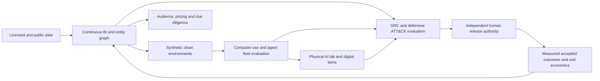

# 100 candidate use cases and workloads

**Status:** planning catalog, not 100 shipped integrations. All examples require explicit data rights, source provenance, independent evaluation and a production release gate. The current Swarm-Context-Commander kernel provides local reference primitives for context, task admission and synthetic evaluation; it does not connect to the data vendors or operate physical fleets. IDs are stable identifiers for discussion and comparison, not a priority ranking.

**Source-rights boundary.** Bloomberg Terminal access does not by itself establish rights for enterprise aggregation or model training; use an appropriate [Bloomberg Data License or approved API](https://professional.bloomberg.com/products/data/data-license/) entitlement. Moody's identifies [Orbis products as formerly including Osiris](https://www.moodys.com/web/en/us/capabilities/company-reference-data/orbis/orbis-national-and-country-products.html). [Argos Atlas's commercial tier](https://www.argosatlas.com/en/pricing/) mentions API access and commercial use, subject to actual terms. These are *candidate data sources*, not current connectors. No proprietary records are included in this repository.

**Evaluation rule.** Every workload needs a frozen baseline, independently accepted outcome, p50/p95 latency, error and exclusion counts, cohort or environment slices, drift, provenance and a zero-tolerance access-boundary test. Synthetic success is a test of the harness, never proof of real demand or field safety. Financial, legal, employment and high-consequence decisions remain with qualified humans.

**Unit-economics rule.** For each row, the displayed denominator defines the unit. Fully loaded cost includes permitted data-license allocation, ingestion, model and GPU idle cost, CPU/browser/VM time, storage and egress, human review, rework, observability, security/compliance and support. `Cost per accepted unit = fully loaded cost / independently accepted units`; report zero-denominator cases as undefined, not zero. For comparative pilots, also report incremental benefit and cost against a locked incumbent with uncertainty intervals. Forecasted savings or avoided failures need validated counterfactuals.

**Phases.** `P0` means an inspectable synthetic or local baseline is a plausible next build; `P1` means consented read-only pilot after source rights and adapter tests; `P2` means sandbox/lab research before operational use; `R` means restricted, high-consequence assurance work with independent legal, safety and human-authority review. Every row is a *suggested workload*, not a claim of current deployment.

## Workload map

## Licensed and public data aggregation

| ID | Workload | Candidate inputs | Evaluation / KPI | Fully loaded unit-cost denominator | Phase | Hard gate |
| --- | --- | --- | --- | --- | --- | --- |
| 001 | Bloomberg market-data entitlement ledger | Bloomberg Data License or approved API contracts, instrument IDs | entitlement violations; feed freshness | cost per entitled instrument-day | P1 | No Terminal scraping or unlicensed reuse |
| 002 | Orbis and former Osiris company graph | licensed Moody's Orbis exports, company IDs | entity precision; ownership freshness | cost per verified company record | P1 | Contract rights and human review |
| 003 | Argos Atlas geospatial-risk ingest | licensed Argos Atlas API, permitted map layers | geocode accuracy; event freshness | cost per reviewed geospatial alert | P1 | API rights and geographic privacy |
| 004 | Public filing change monitor | SEC or equivalent public filings, issuer IDs | material-change recall; false alert rate | cost per accepted filing insight | P0 | Source citation and jurisdiction labels |
| 005 | Cross-border corporate registry normalization | licensed registries, legal entity identifiers | entity-match precision; duplicate rate | cost per resolved legal entity | P1 | Jurisdiction-specific reuse rights |
| 006 | Procurement-award intelligence | official tender feeds, contract notices | award-link precision; lead time | cost per verified opportunity | P1 | No confidential bid inference |
| 007 | Patent and research landscape | patent offices, publications, assignee IDs | citation recall; assignee resolution | cost per reviewed technology cluster | P0 | Provenance and date validity |
| 008 | Supplier exposure signals | consented supplier records, permitted news feeds | supplier event precision; detection delay | cost per reviewed supplier alert | P1 | No unsupported adverse claims |
| 009 | Licensed news and transcript synthesis | licensed news and transcripts, timestamped source IDs | grounding precision; update latency | cost per accepted analyst brief | P1 | Copyright and retention limits |
| 010 | Data-rights and lineage registry | contracts, permitted datasets, transformations | rights coverage; deletion propagation | cost per governed dataset-month | P0 | No training without explicit rights |

## Data science and continuous business intelligence

| ID | Workload | Candidate inputs | Evaluation / KPI | Fully loaded unit-cost denominator | Phase | Hard gate |
| --- | --- | --- | --- | --- | --- | --- |
| 011 | Temporal lakehouse and Iceberg snapshots | consented events, versioned tables | query freshness; reproducibility | cost per query and stored terabyte-month | P1 | Tenant isolation and retention |
| 012 | Identity and entity resolution pipeline | CRM, ERP, registry and partner IDs | match precision and recall | cost per resolved entity | P0 | Human merge review and reversibility |
| 013 | Metric semantic layer | finance, product and operations event definitions | metric consistency; lineage completeness | cost per governed KPI-month | P0 | Approved denominator definitions |
| 014 | Causal KPI attribution | experiment assignment, outcomes, covariates | lift interval; randomization integrity | cost per valid experiment | P1 | No causal claim from correlation |
| 015 | Streaming anomaly triage | consented event streams, seasonal baselines | precision at alert budget; delay | cost per accepted anomaly | P1 | Human disposition labels |
| 016 | Probabilistic demand forecast | sales, capacity, calendar signals | calibration; forecast error | cost per forecasted SKU-week | P1 | Drift and stockout monitoring |
| 017 | Graph-based dependency impact | service map, supplier graph, events | path recall; impact precision | cost per verified dependency path | P1 | Source-linked edges |
| 018 | Cohort economics workbench | consented acquisition and retention events | cohort stability; LTV calibration | cost per analyzed cohort | P1 | No protected-trait targeting |
| 019 | Executive decision briefing | versioned KPIs, annotated evidence | citation accuracy; decision usefulness | cost per accepted briefing | P0 | Analyst signoff |
| 020 | Continuous unit-economics reconciliation | ledger, cloud bill, model usage, outcomes | cost allocation coverage; variance | cost per independently accepted task | P0 | Include license, idle and review cost |

## Synthetic clean environments and training datasets

| ID | Workload | Candidate inputs | Evaluation / KPI | Fully loaded unit-cost denominator | Phase | Hard gate |
| --- | --- | --- | --- | --- | --- | --- |
| 021 | Clean-room fixture compiler | schema contracts, synthetic generators | schema coverage; reproducibility | cost per validated fixture | P0 | No real secret leakage |
| 022 | Privacy-preserving tabular synthesis | consented source statistics, constraints | utility gap; membership-inference risk | cost per usable synthetic row | P1 | Privacy attack assessment |
| 023 | Synthetic document corpus | licensed templates, fictional entities | task realism; citation consistency | cost per validated document | P0 | License and memorization tests |
| 024 | Knowledge-graph scenario generator | typed ontology, synthetic relation rules | constraint validity; path diversity | cost per valid graph scenario | P0 | No real identity reconstruction |
| 025 | Time-series incident replay | sanitized telemetry, simulated outages | temporal fidelity; replay determinism | cost per replayed incident | P0 | Isolated nonproduction environment |
| 026 | Synthetic browser and ERP sandbox | mock websites, fictional transactions | state-transition coverage; rollback | cost per completed sandbox task | P0 | No live financial side effects |
| 027 | Robot digital-twin scenario pack | simulated sensors, objects and failures | sim-to-real gap; safety coverage | cost per evaluated episode | P2 | No autonomous physical deployment |
| 028 | Multimodal annotation quality lab | licensed images, audio, text, consent flags | inter-rater agreement; label error | cost per verified annotation | P1 | Biometric consent and minimization |
| 029 | Adversarial prompt and tool fixture suite | synthetic prompts, tool schemas, decoys | attack detection recall; benign pass rate | cost per validated test case | P0 | Authorized defensive evaluation only |
| 030 | Training-data suitability score | dataset rights, quality, contamination probes | contamination rate; rights coverage | cost per approved dataset | P1 | Explicit model-training rights |

## Synthetic audiences, products, pricing and funnels

| ID | Workload | Candidate inputs | Evaluation / KPI | Fully loaded unit-cost denominator | Phase | Hard gate |
| --- | --- | --- | --- | --- | --- | --- |
| 031 | Synthetic audience hypothesis studio | consented research, fictional agents, product brief | hypothesis diversity; real-world calibration | cost per tested hypothesis | P0 | Synthetic reaction is not demand proof |
| 032 | Product-market fit interview planner | consented interviews, survey evidence | question coverage; insight accuracy | cost per accepted interview plan | P0 | No fabricated respondent claims |
| 033 | Price-elasticity experiment designer | prices, randomized offers, outcomes | elasticity interval; revenue lift | cost per valid price experiment | P1 | Fair pricing and human approval |
| 034 | Conversion funnel diagnosis | consented product analytics, page events | drop-off attribution; experiment lift | cost per verified funnel insight | P1 | Consent and cohort minimums |
| 035 | Recommendation quality simulator | catalog, opt-in interactions, holdout set | nDCG; incremental utility; diversity | cost per accepted recommendation | P1 | No manipulative personalization |
| 036 | Launch messaging test bench | product claims, consented survey panels | claim comprehension; confidence interval | cost per tested message | P1 | No deceptive claims |
| 037 | Onboarding friction mapper | session events, support tickets | time-to-value; abandonment cause | cost per resolved friction point | P1 | PII minimization |
| 038 | Churn prevention decision support | consented account history, service events | retention lift; false outreach rate | cost per retained consenting account | P1 | No discriminatory offers |
| 039 | Regional demand scenario analysis | public statistics, opted-in customer evidence | forecast calibration by region | cost per validated region forecast | P2 | Avoid person-level surveillance |
| 040 | Investor-pitch assumption stress test | financial model, market evidence, objections | unsupported-claim rate; scenario coverage | cost per reviewed pitch model | P0 | No invented traction |

## Customer, investor, vendor and transaction diligence

| ID | Workload | Candidate inputs | Evaluation / KPI | Fully loaded unit-cost denominator | Phase | Hard gate |
| --- | --- | --- | --- | --- | --- | --- |
| 041 | Customer-fit evidence graph | consented needs, product capability, contract scope | fit precision; pilot conversion | cost per qualified pilot | P1 | No automated high-impact eligibility |
| 042 | Investor thesis matching | public investor thesis, founder-approved deck | match precision; useful introduction rate | cost per founder-approved match | P1 | No private investor profiling |
| 043 | Beneficial-ownership review workspace | licensed registry data, legal entity documents | ownership completeness; reviewer correction | cost per reviewed ownership chain | P1 | Licensed data and legal review |
| 044 | Financial statement variance review | authorized statements, audited references | material variance recall; false flags | cost per analyst-approved variance | P1 | No investment advice automation |
| 045 | Vendor and supplier risk packet | contracts, SLAs, verified public evidence | risk-evidence completeness; freshness | cost per approved vendor packet | P1 | Human procurement decision |
| 046 | Data-room completeness checker | authorized deal documents, checklist | missing-item recall; access audit | cost per reviewed data room | P1 | Deal confidentiality |
| 047 | Contract obligation extraction | authorized agreements, clause taxonomy | obligation precision; date accuracy | cost per lawyer-reviewed contract | P1 | Lawyer signoff and privilege controls |
| 048 | Acquisition integration scenario model | authorized operations, systems inventory | integration forecast error; dependency coverage | cost per reviewed integration scenario | P2 | No undisclosed deal data |
| 049 | Capital-efficiency benchmark | approved financials, peer definitions | normalization accuracy; interval width | cost per reviewed comparable set | P1 | Peer-data license |
| 050 | Adverse-event evidence reconciliation | permitted media, company statements, filings | false allegation rate; source conflicts | cost per human-reviewed finding | P1 | Defamation and identity safeguards |

## Advanced computer-use agents

| ID | Workload | Candidate inputs | Evaluation / KPI | Fully loaded unit-cost denominator | Phase | Hard gate |
| --- | --- | --- | --- | --- | --- | --- |
| 051 | Read-only website QA agent | test site, fixture accounts, accessibility tree | accepted defect recall; false defects | cost per verified defect | P0 | Test-only accounts |
| 052 | CRM record reconciliation | authorized CRM export, task queue | match accuracy; duplicate write rate | cost per corrected record | P1 | Approval before write |
| 053 | ERP exception triage | authorized invoices, purchase orders, ERP states | exception precision; cycle time | cost per reviewer-accepted exception | P1 | No autonomous payment |
| 054 | Support case resolution assistant | consented tickets, knowledge base, outcomes | accepted resolution; rework rate | cost per accepted case | P1 | Escalation for high-stakes cases |
| 055 | Procurement quote comparison | approved quotes, specifications | comparison coverage; arithmetic accuracy | cost per approved sourcing packet | P1 | Human award decision |
| 056 | Account onboarding checklist | authorized forms, identity status, task state | completion rate; error rate | cost per completed onboarding | P1 | No automated legal eligibility |
| 057 | Code-change evidence agent | repository, tests, issue tracker | test pass; review corrections | cost per accepted pull request | P1 | Sandbox and human merge |
| 058 | Browser task recovery harness | synthetic website, failure injection | recovery rate; duplicate action rate | cost per recovered task | P0 | Idempotency and rollback |
| 059 | Cross-app workflow replay | approved app mocks, A2A or MCP receipts | trace completeness; state consistency | cost per reproducible workflow | P1 | Credential isolation |
| 060 | Human handoff scheduler | approved task queue, reviewer availability | handoff delay; acceptance rate | cost per human-approved handoff | P1 | Human authority retained |

## Agent swarms, GraphRAG and inference infrastructure

| ID | Workload | Candidate inputs | Evaluation / KPI | Fully loaded unit-cost denominator | Phase | Hard gate |
| --- | --- | --- | --- | --- | --- | --- |
| 061 | Logical agent registry benchmark | synthetic descriptors, tenant IDs | registration throughput; collision rate | cost per registered logical agent | P0 | Do not claim active concurrency |
| 062 | Fair task admission benchmark | tenant queues, token estimates | fairness; starvation; p95 queue delay | cost per admitted task | P0 | Quota and overload tests |
| 063 | Budgeted context compiler | source-linked candidate records, policy | recall at budget; leakage rate | cost per accepted context bundle | P0 | Scope checks before ranking |
| 064 | GraphRAG retrieval comparison | licensed corpus, labeled graph paths | path recall; grounding; latency | cost per grounded answer | P1 | Graph provenance and deletion |
| 065 | Adaptive context policy selector | approved policies, independent feedback | regret; accepted work; guardrail breaches | cost per accepted task | P0 | No self-authorizing policy changes |
| 066 | A2A interoperability harness | official protocol fixtures, agent tasks | conformance pass rate; recovery | cost per interoperable task | P1 | Official version pinning |
| 067 | MCP tool governance plane | approved tool schemas, invocations | unauthorized call rate; tool latency | cost per accepted tool invocation | P1 | Authenticated principal binding |
| 068 | vLLM inference admission router | model pool, token reservations, load metrics | TTFT; throughput; cache isolation | cost per million accepted tokens | P1 | Measured GPU economics |
| 069 | Serverless-container-VM placement | task traits, capacity, isolation needs | SLO pass; placement errors | cost per completed task | P1 | Sandbox and warm-start tests |
| 070 | Multi-tenant recovery drill | durable task log, worker crash fixtures | recovery point; duplicate side effects | cost per recovered task | P1 | Fencing and audit replay |

## Physical AI, VLA models and fleet commanders

| ID | Workload | Candidate inputs | Evaluation / KPI | Fully loaded unit-cost denominator | Phase | Hard gate |
| --- | --- | --- | --- | --- | --- | --- |
| 071 | Robot handover safety recorder | lab sensor stream, consented video, commands | unsafe handover recall; evidence gaps | cost per validated handover episode | P2 | Human stop and lab only |
| 072 | Warehouse pick quality monitor | simulated or consented robot telemetry | pick success; damage; intervention | cost per accepted pick | P2 | Worker safety review |
| 073 | VLA policy evaluation sandbox | simulator trajectories, approved task goals | success; near miss; OOD failure | cost per evaluated episode | P2 | No direct field actuation |
| 074 | Digital-twin calibration loop | simulated dynamics, lab measurements | sim-to-real error; calibration drift | cost per validated twin revision | P2 | Independent test set |
| 075 | Fleet maintenance predictor | authorized equipment telemetry, service logs | lead time; false maintenance alerts | cost per avoided failure | P2 | No safety-critical auto action |
| 076 | UAV infrastructure-inspection review | consented imagery, flight logs | defect precision; mission safety | cost per reviewed asset | P2 | Airspace and privacy rules |
| 077 | UAS link-health observability | authorized MAVLink or equivalent telemetry | dropout detection; recovery time | cost per monitored flight-hour | P2 | No flight-control commands |
| 078 | Human override effectiveness test | synthetic autonomy incidents, intervention log | override latency; success rate | cost per validated override | P2 | Operator training and stop tests |
| 079 | Robot black-box evidence packet | time-synced sensor, action, policy events | reconstruction completeness; clock skew | cost per reviewable episode | P2 | No aviation certification claim |
| 080 | Fleet unit-economics command board | robot uptime, human labor, energy, maintenance | accepted work-hour; downtime | cost per accepted physical task | P2 | Full capital and safety cost |

## GRC, IAM/PAM and ATT&CK-informed defense

| ID | Workload | Candidate inputs | Evaluation / KPI | Fully loaded unit-cost denominator | Phase | Hard gate |
| --- | --- | --- | --- | --- | --- | --- |
| 081 | ATT&CK coverage graph | versioned ATT&CK STIX, controls, alerts | technique-evidence coverage; gaps | cost per validated detection | P1 | Defensive mapping only |
| 082 | Detection strategy evaluation | authorized logs, MITRE strategies and analytics | precision; recall; detection delay | cost per true positive reviewed | P1 | No exploit execution |
| 083 | IAM and PAM behavior review | authorized identity logs, privileged sessions | high-risk session recall; false alarms | cost per reviewed privileged session | P1 | No secret capture |
| 084 | T1078 valid-account anomaly benchmark | synthetic identity events, reviewer labels | detection recall; false-positive rate | cost per detected valid-account misuse | P1 | MITRE version pinning |
| 085 | T1213 repository access anomaly benchmark | synthetic repository audit events | suspicious access recall; benign pass | cost per reviewed anomaly | P1 | Defensive synthetic traces |
| 086 | T1021 remote-service detection benchmark | synthetic remote-session metadata | precision; time to detect | cost per validated alert | P1 | No unauthorized scanning |
| 087 | Agent prompt-injection defense eval | synthetic untrusted documents, tool receipts | unsafe action block; task utility | cost per evaluated agent task | P0 | No live hostile content deployment |
| 088 | Model and connector supply-chain inventory | SBOM, model manifest, signed connector record | inventory coverage; stale version rate | cost per governed component-month | P1 | Signature and provenance checks |
| 089 | ICS telemetry resilience tabletop | synthetic OT logs, safe digital twin | detection delay; safe-state decision | cost per completed defensive exercise | P2 | No live control-system writes |
| 090 | Privacy and retention assurance monitor | consent flags, TTL, deletion receipts | deletion p95; unauthorized retention | cost per governed record-month | P1 | Independent privacy review |

## Dual-use intelligence and military-adjacent assurance

| ID | Workload | Candidate inputs | Evaluation / KPI | Fully loaded unit-cost denominator | Phase | Hard gate |
| --- | --- | --- | --- | --- | --- | --- |
| 091 | OSINT provenance and uncertainty desk | lawful public sources, source metadata | claim support; uncertainty calibration | cost per analyst-reviewed claim | R | No covert collection |
| 092 | Humanitarian situation evidence fusion | public crisis reports, consented field updates | location error; duplicate-event rate | cost per verified situation update | R | Civilian protection and data minimization |
| 093 | Defense logistics readiness forecast | authorized inventory, transport and maintenance | forecast calibration; stockout delay | cost per reviewed logistics decision | R | No targeting or strike support |
| 094 | Coalition compartment boundary test | synthetic classified-like labels, access policy | cross-compartment leak rate | cost per validated boundary test | R | Synthetic data only |
| 095 | Vehicle autonomy safety assurance | simulation telemetry, human-override events | near-miss recall; stop latency | cost per tested vehicle-hour | R | No weapons or autonomous engagement |
| 096 | Communications availability dashboard | authorized network health, outage events | availability; incident detection delay | cost per monitored link-hour | R | No interception payloads |
| 097 | Disinformation evidence assessment | public claims, corroborating sources | claim calibration; false accusation rate | cost per analyst-reviewed assessment | R | No influence targeting |
| 098 | ATT&CK-informed cyber defense tabletop | versioned Enterprise and ICS ATT&CK, mock incidents | coverage; response time; recovery | cost per completed defensive exercise | R | No offensive runbooks |
| 099 | High-consequence decision authority trace | synthetic approvals, policy and action receipts | approval completeness; override latency | cost per independently reviewed decision | R | Human authority and audit |
| 100 | Dual-use deployment assurance board | risk register, tests, rights, human decisions | unresolved critical findings; gate pass | cost per governed deployment-month | R | Independent legal and safety review |

## ATT&CK and dual-use evidence contract

Workloads 081–090 and 098 use [MITRE ATT&CK Enterprise](https://attack.mitre.org/matrices/enterprise/) and, where industrial-control assurance is relevant, [ATT&CK ICS](https://attack.mitre.org/matrices/ics/) as **defensive classification and evaluation sources**. Import versioned [STIX data](https://attack.mitre.org/resources/working-with-attack/) rather than hard-coding a timeless list. Pin the ATT&CK release and map each scenario to `technique_id`, tactic, `detection_strategy_id`, analytic ID, tested control, permitted telemetry, evidence ID, reviewer label and observed outcome. MITRE's older [data-source list is deprecated](https://attack.mitre.org/datasources/); use its current detection strategies, analytics and data components when constructing fresh coverage claims. For AI-specific threat modeling, consider [MITRE ATLAS](https://atlas.mitre.org/); for defensive countermeasure vocabulary, [MITRE D3FEND](https://d3fend.mitre.org/).

Examples to validate on current MITRE pages: [T1078 Valid Accounts](https://attack.mitre.org/techniques/T1078/) for identity telemetry, [T1213 Data from Information Repositories](https://attack.mitre.org/techniques/T1213/) for repository audit review, and [T1021 Remote Services](https://attack.mitre.org/techniques/T1021/) for remote-session monitoring. The catalog uses these to evaluate detections and access boundaries; it contains no intrusion, targeting, covert collection or weapon-control procedure. A technique mapped on paper is not detection coverage. Coverage requires a reproducible test, measured precision and recall, false-negative analysis, detection latency and a named owner for gaps.

## Cross-project boundaries

- [Swarm-Context-Commander](../README.md) owns the inspectable context/admission kernel and benchmark contracts.
- [GRC Claw](https://github.com/AAH20/GRC_Claw), [Physical AI Governor](https://github.com/AAH20/physical-ai-governor), [Audience Swarm Lab](https://github.com/AAH20/audience-swarm-lab), [Outcome Fabric](https://github.com/AAH20/outcome-fabric) and other A2Z projects are **candidate** workload producers, reviewers or evidence consumers. A link here is not a tested integration.
- The [project reference ledger](project-references.md) distinguishes actual adapter code from architectural inspiration.

The strongest immediate P0 pilot is one authorized, read-only dataset plus one measurable task, such as filing-change review or website QA. The broader catalog becomes credible through independently accepted results and source rights, not by connecting all 100 sources at once.
