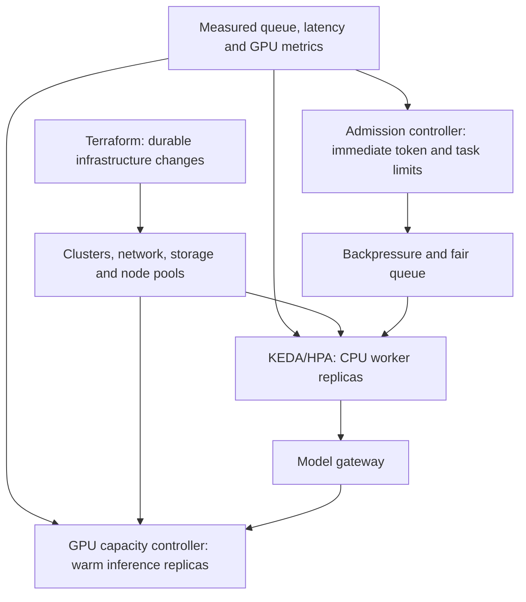
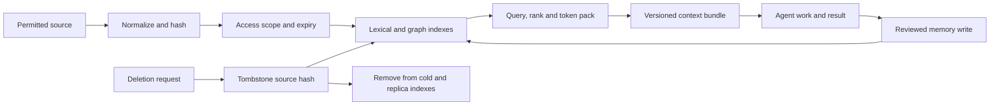

# Architecture and scaling decisions

## Separate the four control loops

Terraform is a slow infrastructure change mechanism, not a per-agent scheduler. Keep root configurations separate from reusable modules; pin provider versions and protect state. The checked-in module creates only a namespace and ConfigMap. [Terraform modules](https://developer.hashicorp.com/terraform/language/modules/develop) and [state](https://developer.hashicorp.com/terraform/language/state) need independent operational controls. KEDA's event-driven 0-to-1 activation and HPA's 1-to-N scaling can later drive actual CPU workers, subject to queue semantics and termination safety. [KEDA scaling behavior](https://keda.sh/docs/2.21/concepts/scaling-deployments/) is the reference; our KEDA file is a placeholder, not a deployment.

GPU inference should not blindly scale to zero: model load time, GPU provisioning delay and prefix-cache loss affect latency. The correct warm floor depends on measured arrival rate, model size, startup time and cost. vLLM owns continuous batching and paged KV allocation; our token-admission layer only decides whether requests can enter the serving pool. Prefix reuse must be scoped by tenant/policy salt to avoid cross-tenant timing leakage. [vLLM prefix caching](https://docs.vllm.ai/en/latest/design/prefix_caching/) documents both its hash-block cache and cache-salt behavior.

## Data structures and asymptotic shape

| Structure | Purpose | Reference complexity |
| --- | --- | --- |
| SQLite B-tree indexes | Agent lookup, tenant lookup, task state | Indexed point lookup `O(log n)`; actual I/O measured |
| Per-tenant binary heap | Priority and deadline ordering | Insert/remove `O(log q_t)` |
| Active tenant deque and deficit counters | Weighted fair service | One tenant visit `O(1)`; large jobs need more visits |
| Lexical inverted index | Candidate retrieval | Posting intersection/union bounded by matching lists |
| Graph adjacency sets | One-hop evidence expansion | `O(degree)` per selected node |
| Content digest and deletion tombstones | De-duplication and anti-resurrection | Hash/set lookup near `O(1)` average |
| In-flight reservation map | Token budget and release | Near `O(1)` average |

The current queue keeps tenant fairness but has no aging within a tenant. A production scheduler must add bounded aging/deadline service, durable queue partitions, explicit lease ownership, work stealing, and starvation tests. The current SQLite database must be replaced or sharded before distributed writes. It is useful as an executable contract, not a claim that one SQLite file handles fleet throughput.

## Context lifecycle

The present in-memory index demonstrates scope, expiry, versioned personal policies and tombstone semantics. A policy can narrow scopes, require a trust floor, prefer bounded terms, and set token limits; it never expands tenant access. Its graph is hand-linked and does not infer entities or relations. Cognee's [memory MCP](https://github.com/topoteretes/cognee/blob/main/cognee-mcp/README.md) can become a graph candidate source, but retrieved text remains untrusted and needs source identity, dataset isolation, correction and deletion testing. Its snippets cannot grant tool authority. `context-graph-compact` is a candidate second compiler for comparative evaluation, not the foundation of untested accuracy claims.

## Runtime selection

Short, read-only, stateless work can fit a serverless function. Browser sessions, writes, and long-running work belong in checkpointable containers. Code execution or higher-risk work should use a stronger isolation backend such as a microVM; [Firecracker](https://firecracker-microvm.github.io/) is one possible technology. Google/AX may supply its own isolated Task/Workspace/Gateway lifecycle. The placement classifier in this repo does not start any of them; an executor interface, identity, budget enforcement, and lifecycle tests are release gates.

## Design patterns

Use an idempotency key on submission; fencing attempts on task completion; append-only execution events with materialized task status; an outbox/inbox for external events; bulkheads between tenants and model pools; circuit breakers for unhealthy providers; bounded retries with a dead-letter queue; and explicit compensation for non-idempotent browser writes. These are implementation targets, not all present in v0.1. `computer_use_event` currently stores a digest and byte count rather than raw observations. The A2A sidecar carries a context digest and artifact reference, but full [A2A](https://github.com/a2aproject/A2A/blob/main/docs/specification.md) protocol conformance remains unimplemented.
