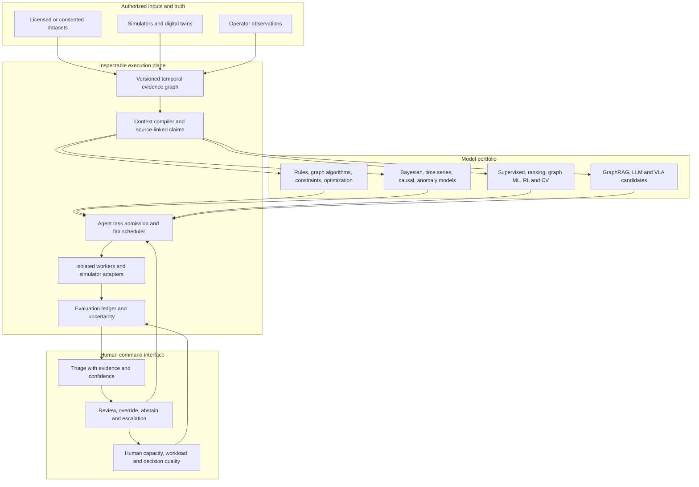
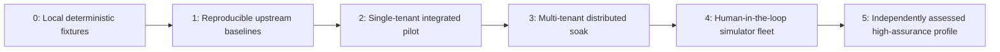
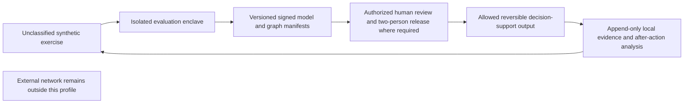

# Evolution and evaluation standard (proposal v0.1)

This document defines **testable interfaces and release gates**, not a claim that the current kernel runs a distributed 150,000-agent fleet, a robot fleet, or a classified command system. Today, `eval-graph` executes one deterministic, synthetic scope/deletion fixture. Every other track below needs an implementation, labeled dataset, independent review and published run artifacts. All operational profiles described here are for authorized, non-weaponized testing and human-supervised decisions.

## 1. System of systems and the human bottleneck

The interface becomes a bottleneck when the arrival rate of decisions requiring review exceeds the *measured* rate at which humans can make correct, timely decisions. More agents do not expand human attention. The control plane must reduce avoidable alerts, group correlated evidence, preserve reversible actions, and abstain when confidence or authority is insufficient. No aggregate score may hide a hard safety, privacy or scope failure.

Define `λ_review` as review-required events per hour, `μ_human` as independently accepted decisions per reviewer-hour, and `H` as staffed reviewers. `ρ = λ_review / (H × μ_human)`. A sustained `ρ ≥ 1` is an unstable queue in the simple capacity model; real staffing requires headroom for bursts, fatigue and incident response. Report p95/p99 time-to-decision, missed-critical rate, false alert rate, override outcome, calibration and NASA-TLX workload alongside `ρ`. Review throughput alone is an unsafe optimization target. [NASA-TLX](https://humansystems.arc.nasa.gov/groups/tlx/downloads/TLX.pdf) is an established subjective workload instrument; the system-specific decision-quality measures here are new proposals.

## 2. Evaluation contract

Every result records: protocol/revision and dataset hashes; source license and consent class; split and leakage audit; model and graph versions; prompts/seeds where applicable; hardware and total cost; denominators; confidence intervals; all excluded cases; failures and side effects; and the human authority boundary. Prefer paired runs on identical held-out tasks. Bootstrap intervals must resample at the **case or organization level** where observations are correlated, never treat repeated model calls as independent customers. Freeze a private holdout before tuning. Publish raw event-level measurements when rights permit, or reproducible aggregates with an independent auditor when they do not.

The overall objective is a **Pareto frontier**, not a single leaderboard number: maximize independently accepted task value and coverage while minimizing error, tail latency, cost, energy, privacy leakage and human workload. For candidate `c`, admit only if every mandatory gate passes; among admitted candidates compare `(accepted_work / total_cost, p95_latency, critical_miss_rate, human_load)`. A lower dollar figure cannot compensate for an authority violation.

### Metric definitions and hard gates

| Dimension | Formula / measurement | Failure gate |
| --- | --- | --- |
| Source retrieval | `recall@k = relevant source IDs retrieved / all labeled relevant source IDs`; precision similarly over retrieved IDs | Any scope leak or deleted-source resurfacing; target recall set per workload |
| Graph construction | Entity/edge precision and recall against independently labeled triples, by relation type; temporal-validity F1; provenance coverage | Cross-tenant edge, unsupported assertion, or missing origin for an accepted high-impact claim |
| GraphRAG answer | Claim-level grounded precision/recall and citation support; abstention accuracy on unanswerable cases | Accepted unsupported high-impact claim |
| Agent work | `accepted_tasks / submitted_tasks`, with reviewer-defined acceptance; duplicate side effects per 1,000 writes | Unauthorized action, unrecoverable inconsistent state or unbounded retry |
| Reliability | p50/p95/p99 end-to-end time, queue age, restart recovery time, and failover data loss | Workload SLO breach under stated load or silent dropped task |
| Cost | `(inference + idle GPU + CPU/VM/browser + storage/egress + labeling + human review) / accepted task` | Missing cost category or acceptance denominator |
| Probabilistic quality | Calibration (ECE/Brier), log loss, predictive interval coverage, OOD false confidence | High-confidence wrong decision above workload risk limit |
| Human command | Accepted decisions/reviewer-hour, critical miss/false escalation, p95 override latency, NASA-TLX | Review arrival exceeds staffed capacity; high-consequence action bypasses authority |

Thresholds are **profile- and consequence-specific**, frozen before each comparison. The matrix in [`benchmarks/evolution-matrix.json`](../benchmarks/evolution-matrix.json) records whether a metric is implemented or proposed; it does not fabricate production targets.

## 3. Graph engineering and GraphRAG

```mermaid
flowchart LR
  IN[Source objects and event stream] --> PARSE[Parse and type]
  PARSE --> ER[Entity resolution with uncertainty]
  ER --> TEM[Temporal and bitemporal relations]
  TEM --> PROV[Provenance, license, scope and deletion lineage]
  PROV --> STORE[Versioned graph and source index]
  STORE --> RET[Lexical, vector, traversal and hybrid retrieval]
  RET --> COMP[Token-bounded context compiler]
  COMP --> ANS[Answer, plan or abstention with cited paths]
  ANS --> JUDGE[Independent labels and human audit]
  JUDGE --> DRIFT[Drift, contradiction and freshness monitor]
  DRIFT --> PARSE
```

Graph schema: `Entity(id,type,tenant,valid_from,valid_to,source_id,confidence)`, `Relation(subject,predicate,object,tenant,valid_time,observed_time,source_id,confidence)`, `Source(id,hash,license,consent,classification,retention)` and `Claim(id,answer_span,supporting_source_ids,graph_path_ids,model_version)`. An embedding is an index, never the authority record. Entity resolution must preserve an `unknown/split` state; forced merging is a measurable failure. Deletion must traverse derived triples, embeddings, summaries and caches. Scope checks run before retrieval expansion and again before output. Typed directed edges distinguish “owns,” “observed,” “reported by,” and “possibly same as”; collapsing them is a semantic error.

Construct four held-out sets: (1) clean factual paths, (2) contradictory and stale updates, (3) decoy same-name entities across tenants, (4) source withdrawal during a running task. Measure extraction F1, entity merge/split error, path recall@k, answer support, false certainty, deletion propagation lag, retrieval tokens and p95. Perturb one fact at a time and require the answer and cited path to change only when logically dependent on that fact. Run answer grading separately from retrieval grading so generation cannot mask missing evidence.

The local `eval-graph` fixture measures only source selection, tenant/agent scope and deletion for four synthetic records. It **does not** measure extraction, embeddings, semantic QA, temporal graph correctness or Cognee. Integrations with Cognee must first prove its native graph operations and deletion semantics on a pinned release.

## 4. Model portfolio: choose the simplest falsifiable model

These are candidate methods and real-world **evaluation designs**, not deployed integrations. All source use requires permission and appropriate data rights. Compare each candidate to a non-AI or simpler model on the same cases.

| Model family | Deterministic / probabilistic contract | Representative authorized use case | Baseline and decisive test |
| --- | --- | --- | --- |
| Rules, finite-state machines | Deterministic predicates and transitions | Enforce an IAM approval chain or data-retention deadline | Hand-coded rules; property tests and conflicting-rule cases |
| Graph algorithms | Deterministic reachability, cut sets, shortest path, temporal joins | Show dependency blast radius of a data-center service outage | SQL join/hand-labeled graph; path precision, graph update time |
| Constraint programming / operations research | Deterministic feasibility and optimization under explicit constraints | Allocate GPUs, reviewers or spare parts with capacity and geographic constraints | FIFO/greedy; feasibility rate, regret to exact optimum on small instances |
| Control theory / MPC | Deterministic or stochastic dynamics, explicit safe envelope | Simulator-only energy and cooling setpoint planning | Existing controller; envelope violations, settling time, energy; no direct plant control from repo |
| GLM and calibrated trees | Probabilistic conditional outcome estimate | Predict support-case rework or incident escalation | Majority/linear baseline; Brier, calibration and subgroup error |
| Bayesian networks / HMM / Kalman | State posterior and uncertainty update | Fuse noisy, authorized telemetry into equipment-health state | Rule thresholds; log loss, interval coverage, delayed-sensor tests |
| Survival / forecasting | Time-to-event distribution and uncertainty bands | Predict component failure windows or queue saturation | Seasonal naive/Cox baseline; time-dependent calibration and missed events |
| Causal inference / uplift | Intervention effect under stated assumptions | Evaluate whether a new support policy improves accepted resolutions | Randomized or matched control; pretrend, sensitivity, treatment-effect CI |
| Anomaly / change-point detection | Tail probability or distribution shift | Flag unexpected data-center demand, cost or graph-ingestion drift | Robust z-score; detection delay and false alarms per day |
| Ranking / recommendation | Ordered candidate utility with calibrated acceptance | Prioritize evidence or support actions for a reviewer | Recency/lexical; NDCG, accepted-work lift and exposure parity |
| Clustering / representation learning | Similarity structure with stability checks | Discover workload cohorts for capacity plans | Hand-defined cohorts; stability under resampling and downstream utility |
| Graph neural networks | Probabilistic node/edge prediction | Predict missing service dependencies for **review**, never as fact | Typed graph heuristics; leakage-controlled link prediction and provenance quality |
| Contextual bandits / RL | Sequential expected reward under logged propensity | Explore approved UI or queue policies in a sandbox | Fixed policy; off-policy estimate, confidence bounds and constraint violations |
| Computer vision / biometrics | Calibrated observation with domain-shift assessment | Consent-based access workflow or safety-zone observation in a test site | Human annotation; subgroup error, spoof resistance and privacy/retention gates |
| LLM / GraphRAG | Source-conditioned claims with abstention | Summarize an authorized incident graph for human review | Extractive template; supported-claim precision and review time |
| VLA / embodied policy | Probabilistic perception-to-action in simulator | Simulated handover or inspection with a physical safety envelope | Scripted robot policy; intervention count, collision/near-miss and recovery |

Reject model complexity when simpler alternatives are statistically indistinguishable on accepted work or when uncertainty cannot be audited. For biometrics, measure false match/non-match rates and demographic performance only on lawful, consented datasets; no covert identification or population-scale surveillance pipeline is provided here.

## 5. Existing suites and new challenge tracks

Use upstream protocols **unchanged** for their original question, then add a separately named system-level track. A higher score on a new track cannot be compared numerically to an upstream leaderboard. Official reference points: [GraphRAG-Bench (ICLR 2026)](https://openreview.net/pdf?id=i9q9xDMjG7), [LongMemEval-V2](https://github.com/xiaowu0162/LongMemEval-V2), [SWE-bench](https://github.com/SWE-bench/SWE-bench), [OSWorld-V2](https://github.com/xlang-ai/OSWorld-V2), [τ-bench](https://github.com/sierra-research/tau-bench), [MLPerf Inference Datacenter](https://mlcommons.org/benchmarks/inference-datacenter/), [BEHAVIOR-1K](https://behavior.stanford.edu/) and [LIBERO](https://github.com/Lifelong-Robot-Learning/LIBERO).

| Existing question | Proposed extension beyond its scope | Required comparison |
| --- | --- | --- |
| GraphRAG-Bench: graph construction/retrieval/generation | Temporal contradictions, tenant isolation, provenance revocation, cost and human verification in one run | Exact upstream score **plus** extension-specific metric vector |
| LongMemEval-V2: long history memory | Deletion, consent changes, human corrections and graph churn across weeks | Recent-N, full context where feasible, lexical, graph and hybrid at fixed budget |
| SWE-bench / OSWorld-V2 / τ-bench: code, computer use, tool-policy tasks | Concurrent agents, side-effect idempotency, failover, reviewer queue and total cost | Same tasks under shared load; accepted end state, side effects, latency |
| MLPerf: model serving performance | End-to-end accepted outcomes under CPU/browser/GPU contention | Official serving result kept separate from task-level throughput and economics |
| BEHAVIOR-1K / LIBERO: embodied behavior | Human intervention, stale perception, fleet contention and simulator-to-lab gap | Simulator score then supervised lab safety/transfer report |

Proposed **EvoGraph-Command** suite adds six challenge tracks: temporal graph correctness; revocation under in-flight work; mixed-model selection under fixed budget; many-agent queue fairness and recovery; human-review overload; and simulator-only physical-fleet coordination. Publish frozen fixture generator, train/dev/holdout split, reference implementations, signed result manifest and independent replay instructions before claiming performance. Red-team generated examples belong in dev; holdout cases cannot be tuned on after inspection.

## 6. Evolution axes and phase gates

Increase axes **independently**, then in combinations: graph nodes/edges and update churn; tenants and data-scope complexity; logical descriptors; *active* tasks; tokens/s; browser/VM sessions; simulation entities; failure rate; reviewer arrivals; and number of distinct models. Suggested measurement points are 1×, 10×, 100× for each axis within available hardware, not an assertion of exponential production capacity. Fit throughput-versus-load curves; report saturation point, elasticity, p99, queue growth, recovery and marginal cost. A system that handles 150,000 registry rows but only 100 live sessions must show both counts.

| Phase | Release evidence | Common bottleneck exposed |
| --- | --- | --- |
| 0 | Deterministic local fixtures, schema and safety invariants | Bad labels, scope mistakes, flaky tests |
| 1 | Reproduced official baselines, held-out split, uncertainty and cost | Dataset leakage, judge sensitivity |
| 2 | Consented single-tenant workload with reversible actions and human acceptance | Data quality, integration latency, reviewer ambiguity |
| 3 | Durable queue/graph, tenant isolation, failure injection, measured active load | Hot partitions, cache contamination, tail latency, GPU/VM contention |
| 4 | Simulator then supervised lab with stop path and physical safety case | Perception shift, control delay, intervention capacity |
| 5 | Independent security/safety assessment under owning organization's rules | Cross-domain authority, accreditation and organizational command latency |

At every phase, a regression in a hard gate blocks promotion. Require a workload owner to approve the acceptance rubric and consequence-specific thresholds *before* looking at holdout results. Publish failures as first-class artifacts.

## 7. High-assurance and human authority profiles

This is an **interface profile for research and authorized evaluation**, not a deployable CJADC2 or classified-network product. The repo handles no classified data, mission orders, weapons control or live fleet command. Any move into a regulated or classified environment requires the owning institution's authorization, accredited boundary, data classification rules, independent assessment and domain-specific safety engineering.

Profile controls: data labels propagate through source, graph, context and output; no cross-domain movement by inference or hidden cache; identity and least privilege are enforced outside this kernel; approval authority is explicit and cannot be inferred from model confidence; disconnected replay uses pinned dependencies and signed provenance; safe defaults are abstention and local stop; evidence is inspectable without leaking protected source content. Map organizational controls to the current [NIST AI RMF](https://www.nist.gov/itl/ai-risk-management-framework) and applicable security standards, but do not label the repo “compliant” or “accredited.” MITRE [ATT&CK](https://attack.mitre.org/) can inform **defensive** detection coverage and validation; it is not a deployment recipe here.

## 8. Engineering standards for the team

The “apex” standard is a **demonstrable competency gate**, not a claim that one person masters every specialty. Each critical change needs the relevant specialist and independent reviewer.

| Specialty | Evidence required before owning a production component |
| --- | --- |
| Algorithms / formal methods | State invariants, asymptotic bounds, property or model-based tests; explain counterexamples |
| Databases / graph engineering | Versioned schema, bitemporal semantics, deletion lineage, query plans, migration and recovery tests |
| Distributed systems / SRE | Idempotency, fencing, partition behavior, load shedding, SLOs, disaster-recovery exercise |
| Statistics / causal science | Frozen estimand, sampling plan, calibration, uncertainty, subgroup analysis, leakage audit |
| ML / data science | Reproducible data/model version, simple baseline, drift and OOD tests, retraining rollback |
| HCI / human factors | Role-based task analysis, measurable workload/decision quality, accessibility, override usability |
| Security / privacy | Threat model, authorization tests, minimization, retention and independent adversarial review |
| Robotics / control | Simulator-to-lab evidence, stability/safety envelope, emergency stop and supervised transfer |
| Systems / performance | Resource accounting, flamegraphs, p99 and cost under mixed workload, reproducible capacity report |

The interface owner must be able to explain **what the machine knows, what it does not know, what action is pending, who may authorize it, and how to stop or reverse it**. Training and staffing plans must test those capabilities as the swarm grows. [NIST AI RMF Core](https://airc.nist.gov/airmf-resources/airmf/5-sec-core/) explicitly addresses measurement, human-AI roles and independent review; the concrete competency gates above are this project's proposal.

## 9. Immediate implementation backlog

1. Turn the current `eval-graph` fixture into a versioned, generated graph set with independently labeled paths, stale facts and deletion-race cases.
2. Add a metric collector that writes per-case results, confidence intervals, resource use and cost rather than only aggregate fixtures.
3. Reproduce one upstream GraphRAG and one agent benchmark on a frozen subset, with exact harness/version and license noted.
4. Implement a review-queue simulator that sweeps `λ_review`, staffing, alert precision and override delay without personal data.
5. Only then add a consented pilot; keep operational profiles conditional on independent safety and security assessment.
