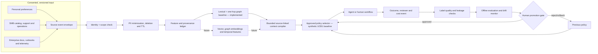
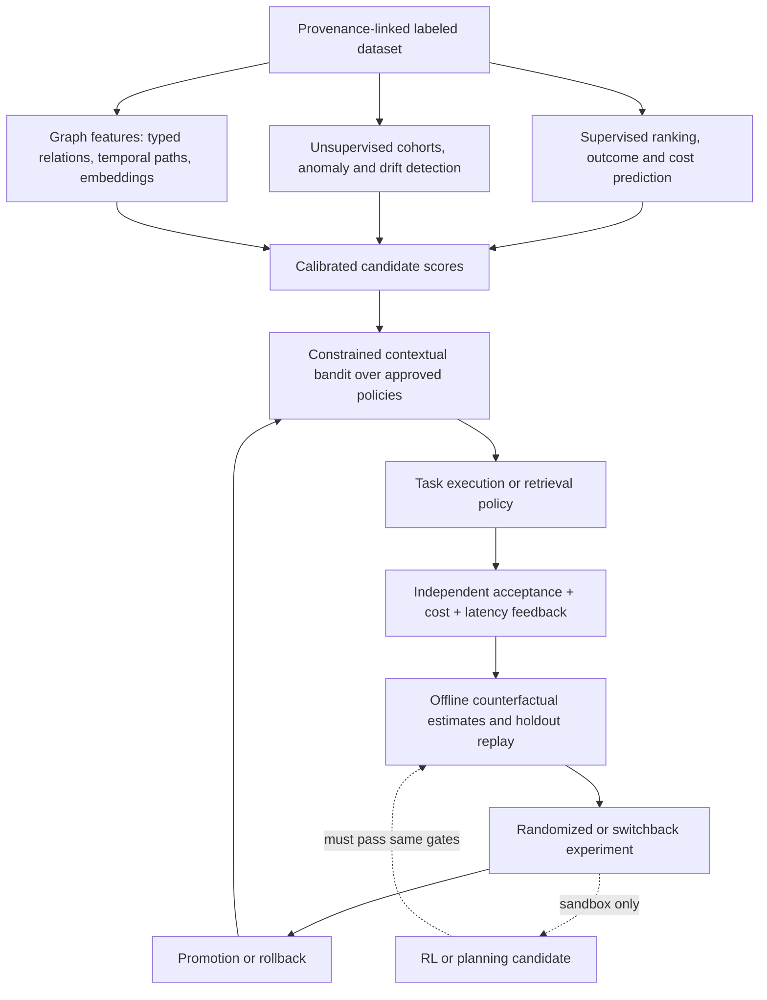

# Personalization and learning architecture

This document separates the **implemented reference** from the target architecture. Run `PYTHONPATH=src python3 -m swarmcontext personalization-demo` for deterministic synthetic consumer, SMB, and enterprise examples. Open [`listings/huggingface-space/index.html`](../listings/huggingface-space/index.html) for the interactive explainer. Neither is evidence of an operating customer deployment.

## Three scales of personalization

| Scale | Decision unit | Permitted context in the reference | Optimization target | Failure that matters | Path to production |
| --- | --- | --- | --- | --- | --- |
| Consumer | One person and one task | Agent-owned + explicitly public records; budgeted, expiring | Accepted answer per cost, user correction rate, p95 response | Stale preference, over-retention, wrong-person recall | Consent, user review/delete, on-device or isolated tenant store, preference drift tests |
| SMB | One organization, team and workflow | Agent-owned + same-tenant records | Accepted workflow resolution per fully loaded cost, rework, stock or service outcomes | Mixing merchants, outdated inventory, invisible human approvals | RBAC, connector freshness, workflow event joins, customer-run acceptance labels |
| Enterprise | Many teams, regions, roles and agents | Same-tenant + agent-owned records only in current kernel | Accepted task under SLO and policy, incident quality, aggregate capacity | Unauthorized lateral knowledge flow, stale runbooks, correlated failure | Identity-bound role/region policy, durable graph, approval gates, audit replay, multi-region recovery |

The current kernel enforces tenant and agent scopes, source tombstones, expiry, trust floors and context budgets. It **does not** implement role/region ABAC, consent management, semantic search, a durable knowledge graph, distributed training, or production feedback collection. These are gates, not marketing claims.

## End-to-end reference and target boundary

The code demonstration uses a fixed reward proxy: `max(0, accepted - 0.2*min(cost_usd,1) - 0.1*min(latency_ms,10000)/10000)`. This deliberately exposes assumptions. It is not a calibrated utility function. A production objective must specify quality, safety, customer value and cost weights before data collection; it cannot allow the same agent to grade its own answer.

## Learning systems beyond GenAI

| Family | Concrete use | Required evaluation | State |
| --- | --- | --- | --- |
| Rules + lexical/graph retrieval | Budget, trust, scope and source-linked selection | Recall@k, source accuracy, leakage, cost | Implemented local reference |
| Contextual bandit | Choose from allowlisted context policies by tier | Regret on fixed synthetic traces, off-policy estimates, variance and cold-start | Implemented in-memory synthetic UCB1 baseline |
| Supervised ML | Predict acceptance, task cost, freshness and escalation | Time-split calibration, PR-AUC, cost-weighted error, subgroup slices | Proposed |
| Unsupervised ML | Detect topic/behavior change and bad source clusters | Detection delay, false alarm rate, cluster stability | Proposed |
| Graph ML | Rank multi-hop evidence and entity relations | Path recall, grounding, cross-scope leak tests | Proposed |
| Causal inference | Estimate incremental lift from a policy or retrieval variant | Randomization integrity, confidence interval, interference analysis | Proposed |
| RL and planning | Evaluate longer workflows in a sandbox | Simulator fidelity, safety constraints, out-of-distribution tests | Proposed; no autonomous promotion |
| Foundation models | Extract, summarize and reason over permitted context | Groundedness, hallucination, prompt-injection resilience, cost | External model integration proposed |

## Evaluation and evolution gates

1. **Data contract:** label every observation with tenant, consent or legal basis, source version, timestamp, reviewer, policy version, model version and cost. Reject missing provenance. Keep raw private records out of public benchmarks.
2. **Offline baseline:** freeze a time-split dataset and compare no-memory, lexical, graph, embedding and hybrid retrieval under identical budgets. Report recall@k, nDCG, answer acceptance, unsupported claims, leakage, p50/p95/p99 latency, token usage and dollars per independently accepted task. Include confidence intervals and cohort slices.
3. **Shadow mode:** run candidate policies without changing production actions. Measure freshness, drift, label delay, disagreement and compute cost. Ensure the candidate cannot expand scope or ignore deletion.
4. **Limited experiment:** randomized assignment within a consented tenant, guardrail metrics, fixed duration and predeclared stopping rules. Compare against a locked incumbent. Report negative and null results.
5. **Promotion:** require security, privacy and business owner signoff for policy changes; store the promotion decision and rollback target. Online learning may change bounded scores, but never authorization or executable code.
6. **Continuous review:** monitor quality decay, distribution shift, reward hacking, unfair cohort outcomes, evidence freshness, queue pressure, GPU cost and cross-tenant leakage. Trigger rollback on violated hard constraints.

A higher score in a synthetic trace is evidence only that the implementation follows that trace. Customer benefit requires representative data, independent labels, prospective evaluation and replication.

## Graph visualization reference

The [Context Atlas](../listings/huggingface-space/index.html) and its [SVG preview](../assets/context-atlas-preview.svg) are original to this repository. They use a synthetic, typed graph fixture shared with the preview generator. The browser explorer can filter relation families, inspect directed edges and node provenance, highlight an explanation path, search, drag, pan, zoom and export SVG. It visually distinguishes admitted, candidate and scope-denied records. It does **not** query a persistent graph, infer relations, execute models or reproduce the Python compiler's exact ranking; the JavaScript selection is an inspectable illustration under a token budget. Integrating Cognee or another graph engine remains subject to provenance, consistency, deletion and tenant isolation tests. See the [reference ledger](project-references.md).

## Measurement contract

A scored task is the unit of evaluation, not a model response or a retrieved chunk. The task record should contain `task_id`, pseudonymous `principal_id`, `tenant_id`, consent/retention status, scenario, assignment arm, policy/model/index versions, task start and end, source IDs, independently recorded acceptance decision, outcome value, complete cost components and eligibility flags. A source graph edge must carry source, type, timestamp, confidence, scope and deletion lineage. Version all schemas and reject unknown versions at ingestion.

| Metric | Numerator / denominator or method | Slice and guardrail |
| --- | --- | --- |
| Accepted-work rate | Independently accepted tasks / eligible completed tasks | Tier, tenant, workflow, language, model, policy; minimum sample size |
| Cost per accepted task | (Inference + idle GPU + CPU + storage + retrieval + human review + rework) / accepted tasks | Report each cost component and zero-acceptance cases |
| Context recall@k | Relevant source IDs in top k / all labeled relevant source IDs | Freshness, source type, sparse vs dense graph; compare no-memory and lexical baselines |
| Grounding precision | Supported factual assertions / sampled factual assertions | Independent reviewer; stratify by answer length and source reliability |
| Leakage rate | Unauthorized source exposures / adversarial scope probes | **Hard gate: zero observed in release suite**, with disclosed suite size and limits |
| Deletion propagation | Time from accepted deletion request to absence from retrieval, caches and exports | p50/p95/p99; test replay and backup retention separately |
| Calibration | Brier score and expected calibration error for predicted acceptance | Time split and cohorts; avoid using confidence as authorization |
| Decision lift | Randomized mean accepted value difference, with confidence interval | Guard against interference between agents and tenant spillover |
| Drift | Distribution shift plus degradation on delayed labels | Source, cohort and temporal slices; label delay reported |
| Reliability | p95/p99 end-to-end latency, timeout and recovery rate | Concurrent sessions, index updates and node failure |

The synthetic UCB1 trace currently has no confidence interval, independent outcome label or causal interpretation. Its purpose is to make the decision rule auditable and test tier partitioning. At production scale, use delayed-feedback handling, off-policy estimators with propensities, minimum exposure limits, guardrail constraints and a holdout population. Retraining must preserve a reproducible snapshot of features, code, data lineage and evaluation results.

## Compounding loop and limits

The useful loop is more source-linked outcomes → better labeled retrieval/evaluation sets → better policies and adapters → more accepted work per dollar → easier deployment. This is a hypothesis to test, not an inevitable growth claim. The counterforces are noisy labels, privacy restrictions, connector maintenance, graph staleness, feedback loops that optimize the wrong proxy, increasing inference cost and customer-specific heterogeneity. Publish benchmark fixtures and evaluation protocols; keep customer records, credentials, negotiated economics and private models under customer control.

A production pilot needs one narrow task family per tier. The first candidate is consumer product advice with synthetic preferences, an SMB inventory/reorder workflow using a consenting merchant's exports, and an enterprise incident handoff using an isolated runbook corpus. Do not combine their results into a single leaderboard score: the acceptance definitions and failure costs differ. Promote a shared engine only after each tier passes its own quality, isolation, deletion, reliability and unit-economics gates.
