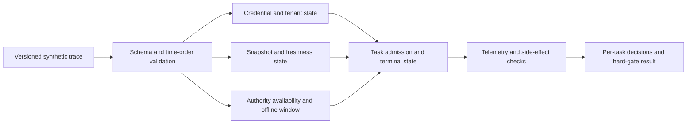

# Protocol interoperability and resilience lab

**Status: local synthetic composition evaluator, version 1.** This is a test harness for a proposed system of systems. It does not implement BGP, A2A, Iceberg, OTLP, an IAM/PAM provider, post-quantum cryptography, or classified-network transport. The current command replays a bounded JSON trace and reports decisions and hard-gate failures. Any native integration requires a pinned upstream version, conformance tests, independent operators and representative workloads.

## Run the reference scenario

```bash
PYTHONPATH=src python3 -m swarmcontext eval-protocol \
  fixtures/protocol-lab.synthetic.json --output outputs/protocol-lab.json
PYTHONPATH=src python3 -m unittest discover -s tests -v
```

The fixture has seven labeled task decisions: normal read, write denied during authority outage, bounded offline read, revoked credential, cross-tenant credential, stale snapshot, and write after recovery. The evaluator checks state transitions, idempotency-key reuse, duplicate side effects, terminal telemetry, and observed decision versus a frozen fixture label. It emits an input SHA-256 so the result can be matched to exact inputs. These labels are manually declared synthetic expectations, **not** independent customer ground truth.



## Protocol profiles and independent benchmarks

| Profile | Standard to implement or reference | First safe adapter | Benchmarks and evolution parameters | Native release gate |
| --- | --- | --- | --- | --- |
| Network reachability | [BGP-4 RFC 4271](https://www.rfc-editor.org/info/rfc4271/) and [RPKI origin validation RFC 6811](https://www.rfc-editor.org/info/rfc6811/) | Read-only route-event import and offline policy simulator | Route-origin validation precision/recall, false rejection, convergence, detection delay, affected prefixes under simulated changes | Independent routing expert review; no live route writes in this project |
| Agent-to-agent | [A2A published specification](https://a2a-protocol.org/latest/specification/) | Native SDK client/server in a local test network | Discovery, task lifecycle, cancellation, artifacts, version negotiation, identity binding, restart and cross-vendor completion | Pass official conformance where available, plus fault/retry/isolation tests; current sidecar is A2A-inspired only |
| IAM/PAM and workload identity | [NIST zero trust](https://csrc.nist.gov/pubs/sp/800/207/final), [OAuth 2.0 Security BCP](https://datatracker.ietf.org/doc/html/rfc9700), [SPIFFE workload API](https://spiffe.io/docs/latest/spiffe-specs/spiffe_workload_api/) | Test-issued workload identities and a mock policy-decision point | False grants/denials, revocation lag, stale-policy window, p99 decision latency, authority-outage blast radius, privileged-session trace coverage | Authenticated provider federation, independently tested revocation and least-privilege enforcement |
| Data and BI | [Iceberg table specification](https://iceberg.apache.org/spec/), [Arrow Flight](https://arrow.apache.org/docs/format/Flight.html), [OTLP](https://opentelemetry.io/docs/specs/otlp/) | Saved snapshots and local export fixtures | Snapshot reproducibility, schema evolution compatibility, freshness, lineage, p95 transfer latency, ingestion loss and cost per accepted analysis | Real catalog/Flight/collector compatibility, permission-aware data lineage and loss accounting |
| Post-quantum readiness | [NIST FIPS 203/204/205](https://csrc.nist.gov/News/2024/postquantum-cryptography-fips-approved) | Algorithm inventory and local interoperability test using maintained libraries | Inventory coverage, certificate/key rotation and rollback, handshake latency, bytes, CPU, failure rate across peers | Validated implementation where required; no homegrown cryptographic primitive or “quantum-safe” blanket claim |
| High assurance | Owning institution's approved standards and authorization process; see public [DCSA guidance](https://www.dcsa.mil/Industrial-Security/NISP-Cybersecurity-Office-NCSO/) | Unclassified synthetic disconnected exercise | Offline reproducibility, label propagation, boundary crossings, operator override, recovery and evidence completeness | Separate accreditation and authorization by the owning authority; no classified data in this repo |

An upstream benchmark is never silently replaced with a proprietary score. Publish the upstream result under its exact protocol, then a separate composition result under this lab's schema. A proposed protocol profile becomes `native_verified` only with upstream version, interoperability matrix, raw test artifacts and an independent review record.

The [machine-readable profile matrix](../benchmarks/protocol-profiles.json) lists each status, metric set and hard gate for future automation.

## Centralization versus federation

The proposed default is **central policy authorship with distributed enforcement**. Every decision needs a versioned policy and authenticated subject/resource context. A local enforcement point may act during a partition only inside a previously declared offline window and action class; writes fail closed in the reference fixture. A revocation learned locally denies further work. This models an availability tradeoff, not a production authorization system: the reference fixture cannot detect a revocation that occurred remotely but has not arrived during an outage.

| Architecture | Advantage | Failure mode to test |
| --- | --- | --- |
| Single central policy decision point | Consistent decisions and global review | Outage stops work; compromise has a large blast radius |
| Replicated central service | Better availability within one authority domain | Stale replicas, split-brain policy versions, inconsistent revocation |
| Federated trust domains | Local autonomy and bounded blast radius | Cross-domain identity ambiguity, delayed revocation, policy translation drift |
| Fully local policy | Disconnected operation | Long-lived stale grants and difficult global audit |

The benchmark varies authority outage length, offline read window, revocation delivery lag, policy version skew and tenant count independently. Report **false grants**, false denials, p99 decision time, percentage of tasks degraded or stopped, maximum stale-policy duration and affected tenants. A composite score cannot erase a false grant for a high-consequence action. [NIST SP 800-207A](https://csrc.nist.gov/pubs/sp/800/207/a/final) describes identity-oriented enforcement for cloud-native systems; this project still needs a real authenticated integration.

## Quantum and post-quantum boundaries

Post-quantum cryptography is a migration of cryptographic mechanisms on classical computers. It is separate from quantum computing and quantum networking. Start with a cryptographic bill of materials for every transport, certificate, signature, backup and long-lived data asset, then test supported algorithms and interoperability. Track both **security posture** and operational overhead: handshakes per second, p99 latency, key/certificate size, CPU cost, downgrade behavior and rollback. NIST lists [ML-KEM, ML-DSA and SLH-DSA](https://www.nist.gov/pqc) as finalized standards; use maintained, appropriately validated implementations where required, not novel algorithms from this repository.

## Composition scorecard

For every workload, publish a vector rather than one rank:

`(correct_authorized_outcomes, false_grants, false_denials, duplicate_effects, missing_telemetry, p99_latency, recovery_time, affected_tenants, total_cost, human_review_load)`

Hard gates: no forbidden cross-tenant action, no unapproved high-consequence write, no duplicate external side effect, no silent terminal task, and no unsupported conformance claim. Success on a four-record or seven-task fixture says only that the local evaluator obeyed that fixture. Scale axes include active tasks, tenants, policy replicas, protocol versions, data snapshots, event rate, fault rate and review arrivals; report the first bottleneck and marginal cost at each load. See the wider [evolution and evaluation standard](evolution-evaluation-standard.md).

## Next implementation gates

1. Replace synthetic A2A-shaped events with a pinned native A2A SDK and its conformance suite; compare task-state semantics and cancellation across two implementations.
2. Add a real test-only SPIFFE identity issuer and policy-decision point; test stale revocation during partitions and prove no tenant crossing.
3. Read actual Iceberg snapshot metadata and emit OTLP through a local collector; verify lineage and missing telemetry end to end.
4. Add read-only public BGP/RPKI import and an offline routing-policy simulator with externally labeled incidents.
5. Add a PQC inventory/interoperability profile using maintained libraries and independent cryptographic review.
6. Keep high-assurance work in unclassified fixtures until an authorized institution defines the boundary, controls and acceptance process.
